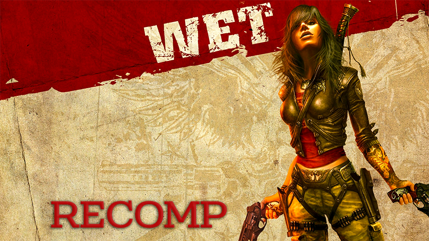

# WetRecomp

<div align="center">
  
</div>

A static recompilation of [**WET**](https://en.wikipedia.org/wiki/Wet_(video_game)) (2009, Xbox 360, Title ID `425307DB`) to native Windows/Linux x86-64, built on the [ReXGlue SDK](https://github.com/rexglue/rexglue-sdk).

## Status

Fully playable: video, audio, gameplay, achievements, and progression all work.

## Requirements

- CMake 3.25+, Ninja, Clang/LLVM (clang-cl works too)
- [ReXGlue SDK](https://github.com/rexglue/rexglue-sdk/releases) — see [`rexglue/README.md`](rexglue/README.md)
- [extract-xiso](https://github.com/XboxDev/extract-xiso/releases) and your own legally-owned copy of WET

## Setup

1. **SDK** — download the `win-amd64` release and extract into `rexglue/win-amd64`.
2. **Licence copy** of game  Title ID: `584109C2` (XA-2498), Media ID: `3077A693`, Module hash = `9A084828F85F951B`.
2. **Game data** — extract the Xbox 360 ISO with `extract-xiso.exe -x WET.iso`, then copy the contents into `assets/`:
   ```
   assets/
     default.xex
     nxeart
     lu0/  lu1/
     media/  movies0/  movies1/
     streams0/  streams1/
   ```

## Build

```powershell
cmake --preset win-amd64-relwithdebinfo
cmake --build out\build\win-amd64-relwithdebinfo
```

```bash
cmake --preset linux-amd64-relwithdebinfo
cmake --build out/build/linux-amd64-relwithdebinfo
```

## Run

```powershell
cd out\build\win-amd64-relwithdebinfo
.\wetrecomp.exe
```

Logs land in `out\build\<preset>\logs\*.log`.

## Configuration

`settings/hardware.toml` (rendering/perf) and `settings/mapping.toml` (input) load automatically. CLI flags and `REX_*` env vars override them. See [`settings/README.md`](settings/README.md) for the reference.

## Credits

- [ReXGlue SDK](https://github.com/rexglue/rexglue-sdk)
- [extract-xiso](https://github.com/XboxDev/extract-xiso)
- [xenia](https://github.com/xenia-project/xenia) / [xenia-canary](https://github.com/xenia-canary/xenia-canary)
